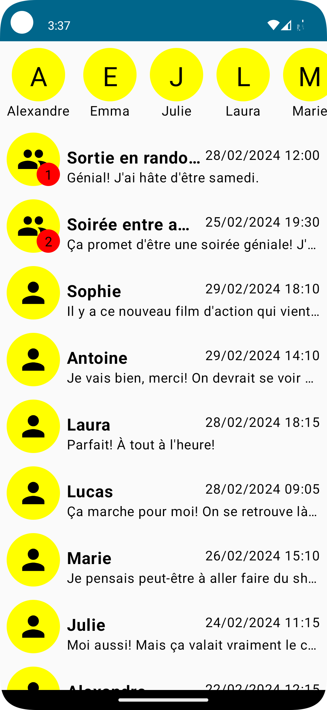
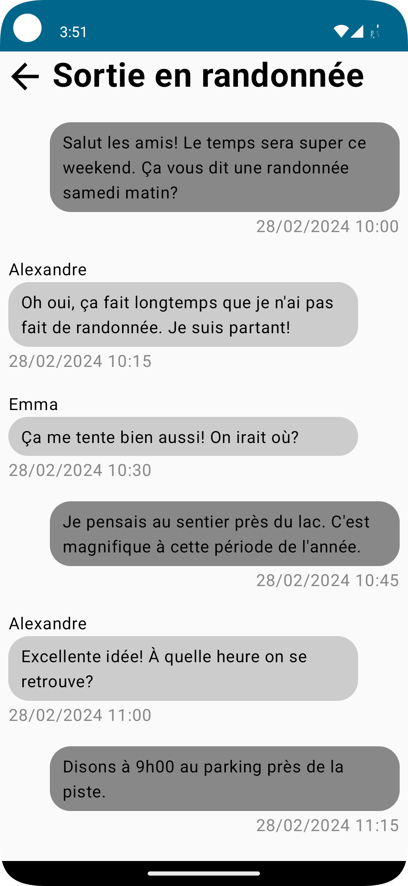

# But

Le but de ce TP est de créer les visuels d'une application de messagerie. Nous vous fournissons un squelette d'application où il ne manque que les vues, à vous de compléter `HomeScreen.kt` et `ConversationScreen.kt` pour obtenir les écrans suivants.

# Guide

Avant de commencer, jetez un œil au package `data` pour comprendre les objets que vous allez utiliser.
Les icônes dont vous aurez besoins se trouvent dans `res/drawables`.
Vous trouverez également dans le package `ext` une méthode pour vous aider à afficher des dates.

Pensez à découper vos vues en sous-composants et à utiliser les previews compose pour vous aider dans la création de vos vues.

# Exercice 1

Commencez par reproduire l'écran principal dans `HomeScreen.kt`.

Celui-ci contient une liste des contacts favoris pouvant scroll horizontalement et une liste de conversations pouvant scroll verticalement.

Attention à bien respecter les conditions suivantes :

- Les contacts sont triées par ordre alphabétique.

- Les contacts favoris doivent sortir de l'écran lors d'un scroll vertical.

- Cliquer sur un contact ouvrira la conversation avec cette personne uniquement (pour faciliter les interactions utilisateur, la zone de clic doit être maximale : cliquer entre 2 contacts doit être un clic sur le contact le plus proche).

- Une conversation peut être avec une ou plusieurs personnes ce qui est indiqué par une icône.

- Les conversations sont triées par date du dernier message reçu/envoyé de la plus récente à la plus ancienne. 

- Les conversations ayant des messages non lus doivent prendre la priorité sur les autres et auront une pastille indiquant combien de messages sont à lire (tout en respectant la règle de tri précédente entre elles).

- La date et le texte affichés pour chaque conversation correspondent au message le plus récent de celle-ci.

- Cliquer sur une conversation ouvrira cette conversation (pour faciliter les interactions utilisateur la zone de clic doit être maximale : cliquer entre 2 conversations doit être un clic sur la conversation la plus proche).

# Exercice 2

Reproduisez l'écran de conversation dans `ConversationScreen.kt`.

Celui-ci possède un en-tête contenant le nom de la conversation et un bouton retour, ainsi qu'une liste des messages envoyés.

Attention à bien respecter les conditions suivantes :

- L'en-tête ne doit pas défiler lors d'un scroll vertical (les messages partent sous l'en-tête).

- Les messages sont triés par date du plus ancien au plus récent. 

- En arrivant sur cet écran, vous devez être en bas de la liste (et donc pouvoir scroll vers le haut pour remonter la conversation… le paramètre `reverseLayout` devrait vous être utile).

- Les messages envoyés par l'utilisateur (sender = `null`) doivent être ancrés à droite et ceux de ses contacts à gauche.

- Le nom du contact qui a envoyé un message ne doit être affiché que dans les conversations de groupe.

- Les messages non lus doivent être signalés par une bordure colorée.

# Pour aller plus loin

- Faites en sorte de regrouper les messages d'une conversation envoyés le même jour.
